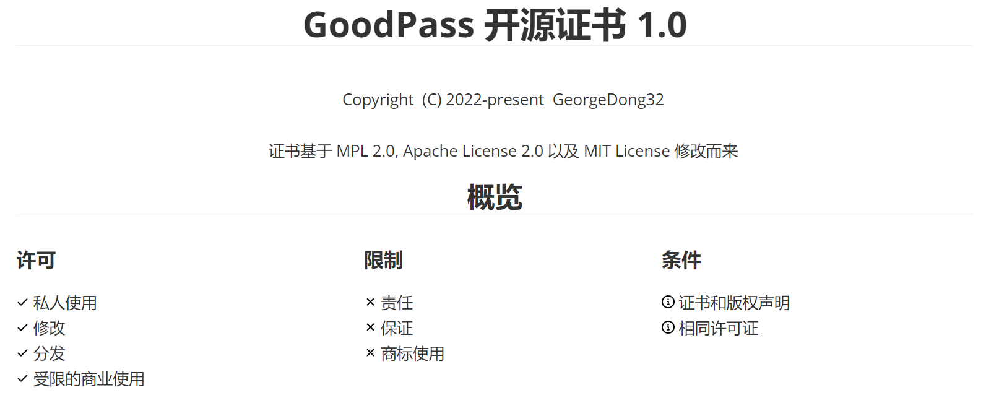

<h1 align="center">
GoodPass -- 开发中的密码管家
<h1 align="center">
  
</h1>
  

    <a href="./README_tcn.md">繁體中文</a>
    |
    <a href="../../README.md">English</a>
  

<h4 align="center">
    <a href="https://github.com/GeorgeDong32/GoodPass-CLI">前往GoodPass CLI开发仓库</a>
    |
    <a href="https://github.com/GeorgeDong32/GoodPass-GUI">前往GoodPass GUI开发仓库</a>
</h4>
<h4 align="center">
  <a href="https://georgedong32.github.io/GoodPass">前往项目主页获取更多信息</a>
</h4>

## ©️ 版权

> **由GeorgeDong32开发并发布** 
>
> **<Copyright (c) GeorgeDong32(Github). 保留所有权利.>** 
## 🎤 简介

GoodPass是一个开发中的密码管家。它目前完全在本地运行，在本地加密和解密您的数据，无需担心联网所带来的安全风险。

在新的开发规划下，GoodPass分为两个大版本持续开发，分别为CLI版本和GUI版本。

## 📦 发行版本  

您可以在[Releases](https://github.com/GeorgeDong32/GoodPass/releases)界面获取应用,我对您的使用表示由衷地感谢。

您也可以前往子项目仓库获取最新预览版本尝鲜。

## 💬 反馈  

作为一个开发中的应用，我十分希望听到使用者的反馈，您可以将你的建议或意见发送到 `georgedong32@foxmail.com` 或点击上方的Feedback按钮进入Issue板块提交反馈。

## ✨功能

### 密码管家功能

GoodPass为您提供一套高效的密码管理系统，同时内嵌密码生成器，可以极大地方便你的密码管理

### 安全体系

GoodPass 使用 **GPHES** 和 **GPSES** 两套安全加密系统来保护您的数据安全。**GPHES**用于验证使用者身份，**GPSES**用于加密存储密码

### 更多

前往 [`功能`](https://georgedong32.github.io/GoodPass/features) 页面获取更多信息

## 📈 开发

### 开发路线图

即将推出

### 开发计划

GoodPass GUI 和 GoodPass CLI已经可以使用。接下来将会继续进行优化，添加更多新功能。

## :balance_scale: 开源证书

[GoodPass开源证书](https://github.com/GeorgeDong32/GoodPass/blob/main/Docs/License/LICENSE_ZH.md)

<h2 align=center>
    
</h2>
