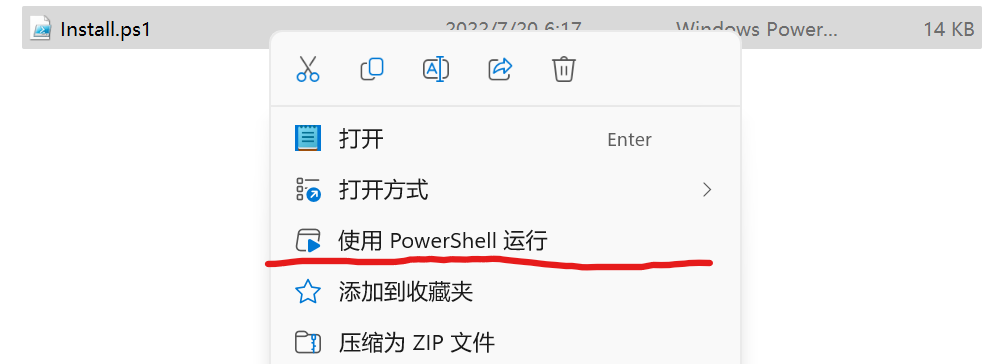

# GoodPass v3安装指南

## 选择合适的包

前往[GoodPass-v3 Release](https://github.com/GeorgeDong32/GoodPass-v3/releases)选择合适和你喜欢的包。其中Debug包通常较小，但是可能不稳定，Release包通常较大，相对较为稳定。选好后点击下载即可准备安装。

## 安装GoodPass

下载好安装包(压缩包)后，请先将它解压缩到你喜欢的位置，接下来进入安装步骤。

### 通过PowerShell自动安装

进入解压后的文件夹，结构应如下图所示

**右键**单击**Install.ps1**，会出现“使用Power Shell安装”选项，点击它，控制台窗口指示进行操作即可完成安装。若没有出现该选项，请跳到后面手动安装的部分。

### 手动安装

进入解压后的文件夹，结构应如下图所示

#### 安装证书

双击后缀为**.cer**、类型为安全证书的文件，具体如下

随后按照证书安装助手指引完成安装

点击安装证书按钮

点击“下一页”

继续点击“下一页”

点击“完成”

出现安全警告时，请确认信息无误，随后点击“是”

出现上方提示框即完成证书安装，进入下一步安装应用

#### 安装应用

点击MSIX安装包，安装包如下

等待出现以下画面，点击安装

等待安装完成即可使用

