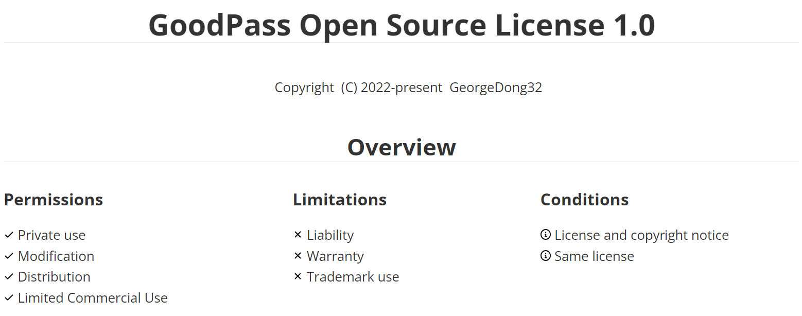

<h1 align="center">
GoodPass -- A developing password manager
<h1 align="center">
  
</h1>
  

    <a href="./Docs/Readmes/README_tcn.md">繁體中文</a>
    |
    <a href="./Docs/Readmes/README_scn.md">简体中文</a>
   

</h1>
<h4 align="center">
    <a href="https://github.com/GeorgeDong32/GoodPass-CLI">View GoodPass CLI Developments</a>
    |
    <a href="https://github.com/GeorgeDong32/GoodPass-GUI">View GoodPass GUI Developments</a>
</h4>
<h4 align="center">
  <a href="https://georgedong32.github.io/GoodPass">Go to project page for more infomation</a>
</h4>

## ©️Copyright

> **Developed by GeorgeDong32** 
> 
> **Copyright (c) GeorgeDong32(Github). All rights reserved.** 

## 🎤Introduction
GoodPass is a developing password manager that help to to manage your passwords. It now works locally with a off-line encryption system to protect your data. 

Under the new development plan, GoodPass is divided into two major versions of continuous development, namely the CLI version and the GUI version.

## 📦Releases  

You can get the application in [Releases](https://github.com/GeorgeDong32/GoodPass/releases) part, thanks for using it.

To get pre releases, please go to subproject repo.

## 💬 Feedback  

Of course, I'm looking forward to your feedback.
It is such a fortune to meet you here! You can provide your advise to me at georgedong32@foxmail.com or at the [Issue](https://github.com/GeorgeDong32/GoodPass/issues) part of Github.

## ✨Features and Support 

### Password Manager

GoodPass provide you with a password manage system which helps you to manage your passwords easily. Also a password generator is inside.

### Security

GoodPass uses GPHES and GPSES to protect your data. The GPHES helps verify your identity, while GPSES makes sure your passwords are stored encrypted.
### More Information
View the [`Features Page`](https://georgedong32.github.io/GoodPass/features) to get more information.

## 📈Development

### Development roadmap

Comming soon..

### Development Plan

The GoodPass GUI and GoodPass CLI are already available. Optimizations will continue to be made to add more new features.

## :balance_scale: Licnese

[GoodPass Open Source License](https://github.com/GeorgeDong32/GoodPass/blob/main/LICENSE.md)

<h2 align=center>
    
</h2>
