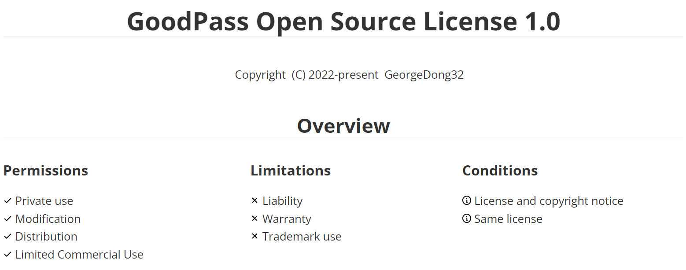
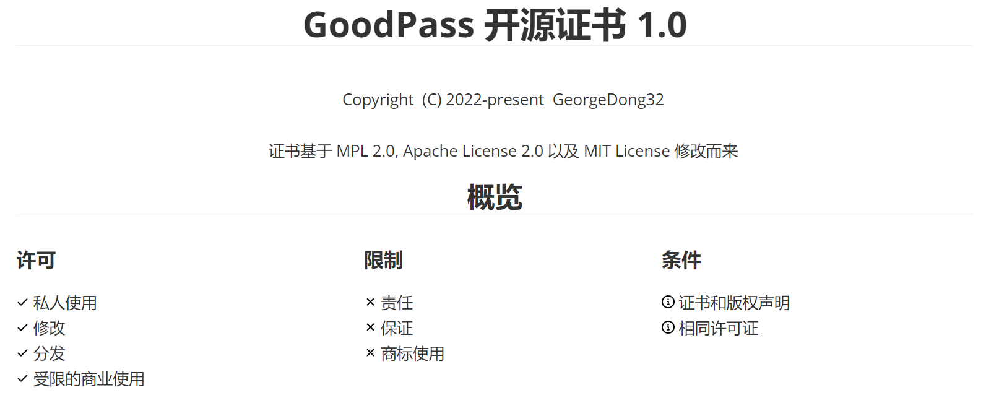

# GoodPass - release

    <picture>
      <source media="(prefers-color-scheme: dark)" srcset="./img/GoodPass3.0_Title_white.png" width=400>
      <source media="(prefers-color-scheme: light)" srcset="./img/GoodPass3.0_Title.png" width=400>
      
    </picture>

This branch is only the target branch of release and has no practical meaning. To obtain the source code of the distribution, go to the development repository of the corresponding version.

此分支仅作为release的目标分支，无实际意义。获取发行版的源代码请前往对应版本的开发仓库。

## License

[GoodPass Open Source License](https://github.com/GeorgeDong32/GoodPass/blob/main/LICENSE.md)

[GoodPass开源证书](https://github.com/GeorgeDong32/GoodPass/blob/main/Documents/License/LICENSE_ZH.md)

    

    

